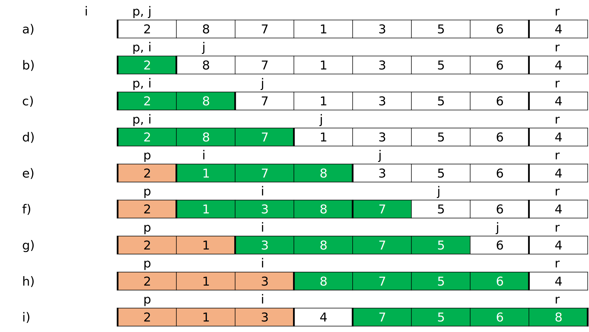
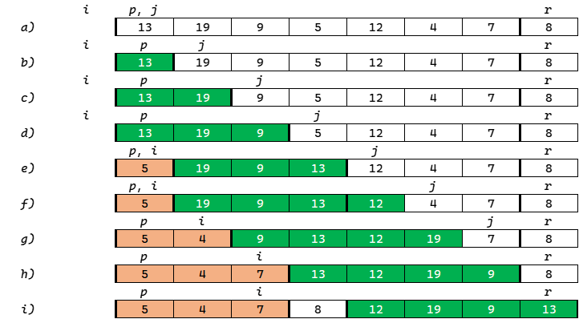

# 第三章-作业

## 1

以下是快速排序中的一种 $PARTITION$ 方法的伪代码及过程：

$PARTITION(A,\,p,\,r)$
```c
x <- A[r]
i <- p-1
for j <- p to r-1
	do if A[j] <= x
		then i <- i+1
			exchange A[i] <-> A[j]
exchange A[i+1] <-> A[r]
return i+1
```



仿照上图说明 $PARTITION$ 过程作用于数组 $A = <13,19,9,5,12,4,7,8>$ 的过程。

答：



## 2

以下图为模型，说明合并排序在输入数组 $A = <3,41,52,26,38,57,9,49>$ 上的执行过程。


答:

## 3

假设 $A$ 和 $B$ 是长度为 $n$ 排好序的数组，且数组中每个数都是不同的。


### 3.1

设计一个算法，在 $O\left(\log n \right)$ 时间里找出这 $2n$ 个数的中位数，其中 $2n$ 个数的中位数为从小到大排序的第 $n$ 个数。

答：

分别求两个升序序列 $A$、$B$ 的中位数，设为 $a$ 和 $b$。若$a = b$，则 $a$ 或 $b$ 即为所求的中位数；否则，舍弃 $a$、$b$ 中较小者所在序列之较小一半，同时舍弃较大者所在序列之较大一半，要求两次舍弃的元素个数相同。在保留的两个升序序列中，重复上述过程，直到两个序列中均只含一个元素时为止，则较小者即为所求的中位数。

### 3.2

证明你的算法复杂度为 $O\left(\log n \right)$。

答：

- 分解：分解步骤仅仅比较两个升序序列 $A$、$B$ 的中位数，需要常量时间，因此，$D(n) = \Theta (1)$。
- 解决：我们递归地解决一个规模均为 $n/2$ 的子问题，将贡献 $T(n/2)$ 的运行时间。
- 合并：我们已经注意到这里不需要合并。

给出最坏情况运行时间 $T(n)$ 的递归式：

$$
\begin{equation}
  T(n) = \begin{cases}
  \Theta (1) & \text{若 }  n = 1 \\
  T(n/2) + \Theta(1) & \text{若 } n > 1
  \end{cases}
  \end{equation}
$$

显然 $T(n) = O(\log n)$。

## 4

$n$ 枚硬币，其中有一枚是假币，己知假币的重量较轻。现只有一个天平，要求用尽量少的比较次数找出这枚假币。我们用 $f(A,first,last)$ 函数来完成上述功能。请写出该函数的伪代码 (其中 $A$ 表示硬币数组 $[1..n]$，$first$，$last$ 为当前考虑的硬币数组中的第一个和最后一个下标，函数返回值为假币的下标)。

答：

$f(A,first,last)$
```c
low <- first
high <- last
while low <= high
	mid <- first + (last - first)/2
	for i <-low to mid do
		sum1 += A[i]
		sum2 += A[i + mid]
	if sum1 < sum2 //前半部分重量和更小，意味着假币在前半部分
		then high <- mid - 1 //最高下标调整到中位下标小一位
		else if sum1 > sum2
			then low <- mid + 1
		else
			then return mid
```

## 5

假设给定一个不同整数组成的已经排好序的数组 $A[1,...,n]$，我们需要在该数组中查找是否存在索引 $i$，使得 $A[i] = i$。

### 5.1

尝试用描述分治算法来解决该问题。要求写出伪代码。

答：

描述：

按下标查找中位数的值，如果 `A[n/2] == n/2`，则返回 `ture` ；否则，以该中位数为界将数组分成两个数组，重复上述过程，直到数组的长度为 $1$ 为止。结束递归后，如果算法还未结束，则返回`false`。

伪代码：

$FindEqual(A,\,first,\,last)$

```c
low <- first
high <- last
while low <= high
	mid <- first + (last - first)/2
	if (A[mid] == mid) return ture
          else FindEqual(A,1,mid-1)
               FindEqual(A,mid+1,n)
return false
```

### 5.2

使用**主定理**估计第 $1$ 小题中你所描述算法的复杂度。

注意：给出的算法应当保证在 $O(\lg n)$ 的运行时间内。

答：

假定原问题规模是 $2$ 的幂，可以简化递归式。这时每个分解步骤将产生规模刚好为 $n/2$ 的两个子序列。在保留的

- 分解：分解步骤只有赋值和判断表达式几个步骤，需要常量时间，因此，$D(n) = \Theta (1)$。
- 解决：我们递归地解决一个规模近似为为 $n/2$ 的子问题，将贡献 $T(n/2)$ 的运行时间。
- 合并：我们已经注意到这里不需要合并。

给出最坏情况运行时间 $T(n)$ 的递归式：

$$
\begin{equation}
  T(n) = \begin{cases}
  \Theta (1) & \text{若 }  n = 1 \\
  T(n/2) + \Theta(1) & \text{若 } n > 1
  \end{cases}
 \end{equation}
$$

$$
a = 1,b = 2,f(n) = \Theta(1),n^{log_b a} = n^{log_2 1} = 1 \\
f(n) = \Theta(1)
$$

所以 $T(n) = f(n) \lg n = O(\lg n)$。

