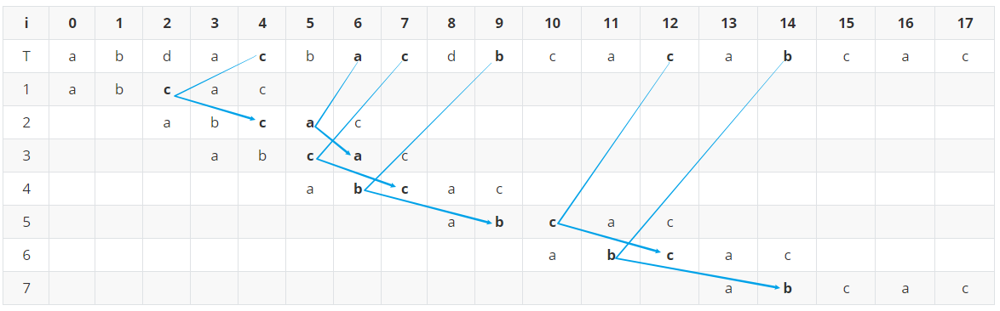

# 第九章-作业

## 1

根据 KMP 算法中 $\pi$ 数组的计算方法，求串 $S = 'babab'$ 的 $\pi$ 数值序列。

答：

1. 计算 $\pi[0]$：$\pi[0] = 0$

2. 计算 $\pi[1]$​：$S[0] = 'b'$

   - 无前缀后缀(不包括本身)

   - 因此 $\pi[1] = 0$

3. 计算 $\pi[2]$：$S[0,1] = 'ba'$

   - 前缀包括：$b$

   - 后缀包括：$a$

   - 因此 $\pi[2] = 0$

4. 计算 $\pi[3]$​：$S[0,1,2] = 'bab'$

   - 前缀包括：$b$, $ba$

   - 后缀包括：$b$, $ab$

   - 因此 $\pi[3] = 1$

5. 计算 $\pi[4]$：$S[0,1,2,3] = 'baba'$

   - 前缀包括：$b$, $ba$, $bab$

   - 后缀包括：$a$, $ba$, $aba$

   - 因此 $\pi[4] = 2$

6. 计算 $\pi[5]$​：$S[0,1,2,3,4] = 'babab'$

   - 前缀包括：$b$, $ba$, $bab$, $baba$
   - 后缀包括：$b$, $ab$, $bab$, $abab$

   - 因此 $\pi[5] = 3$

 $\pi$ 数值序列：

|      |  0   |  1   |  2   |  3   |  4   |  5   |
| :--: | :--: | :--: | :--: | :--: | :--: | :--: |
|  p   |  0   |  0   |  0   |  1   |  2   |  3   |

## 2

1. 写出 BMH 算法的偏移表计算公式。

2. 如下表格是 BMH 算法的匹配过程，请写出第 $2$ 到 $5$ 行的内容。

|  i   |  0   |  1   |  2   |  3   |  4   |  5   |  6   |  7   |  8   |  9   |  10  |  11  |  12  |  13  |  14  |  15  |  16  |  17  |
| :--: | :--: | :--: | :--: | :--: | :--: | :--: | :--: | :--: | :--: | :--: | :--: | :--: | :--: | :--: | :--: | :--: | :--: | :--: |
|  T   |  a   |  b   |  d   |  a   |  c   |  b   |  a   |  c   |  d   |  b   |  c   |  a   |  c   |  a   |  b   |  c   |  a   |  c   |
|  1   |  a   |  b   |  c   |  a   |  c   |      |      |      |      |      |      |      |      |      |      |      |      |      |
|  2   |      |      |      |      |      |      |      |      |      |      |      |      |      |      |      |      |      |      |
|  3   |      |      |      |      |      |      |      |      |      |      |      |      |      |      |      |      |      |      |
|  4   |      |      |      |      |      |      |      |      |      |      |      |      |      |      |      |      |      |      |
|  5   |      |      |      |      |      |      |      |      |      |      |      |      |      |      |      |      |      |      |
|  6   |      |      |      |      |      |      |      |      |      |      |      |      |      |      |      |      |      |      |
|  7   |      |      |      |      |      |      |      |      |      |      |      |      |      |  a   |  b   |  c   |  a   |  c   |

答：

1. BMH 算法的偏移表计算公式

$$
\begin{equation}
shift[w] = \begin{cases}
m - 1 - max\{i < m - 1 | P[i] = w\}, & \text{if } w \text{ is in } P[0 \cdots m - 2]; \\
m, & \text{otherwise}.
\end{cases}
\end{equation}
$$

$$
shift[a] = 1 \\
shift[b] = 3 \\
shift[c] = 2
$$

2. 参考图

